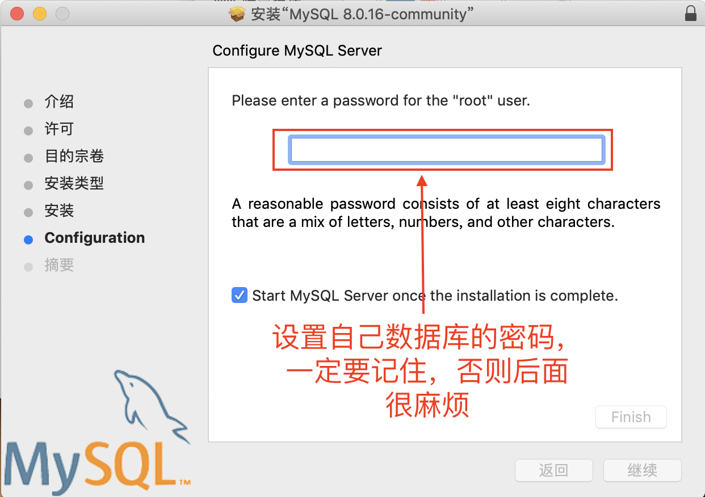
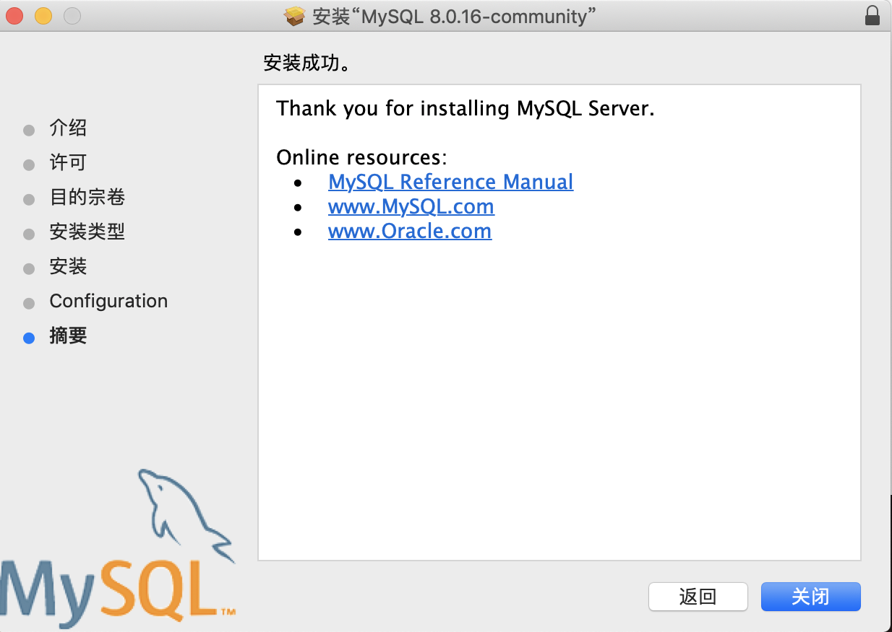
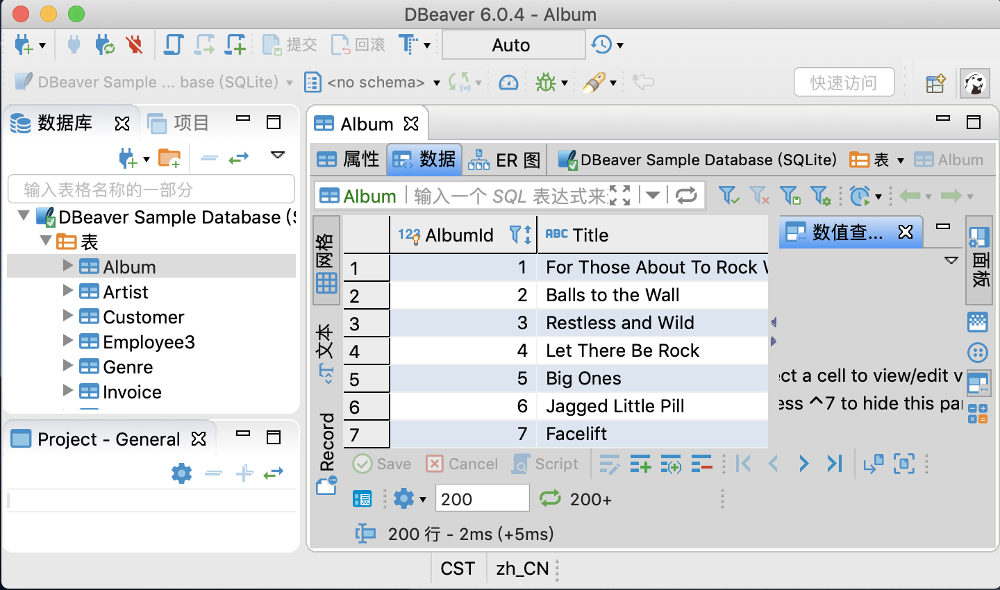
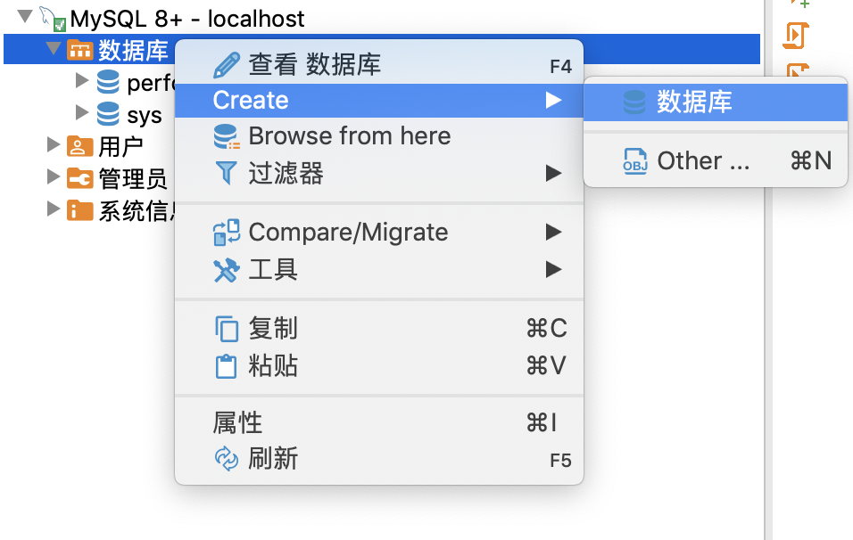
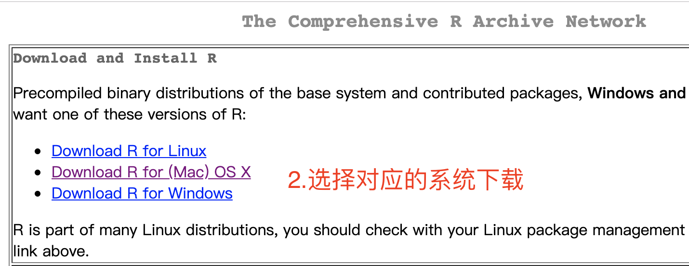
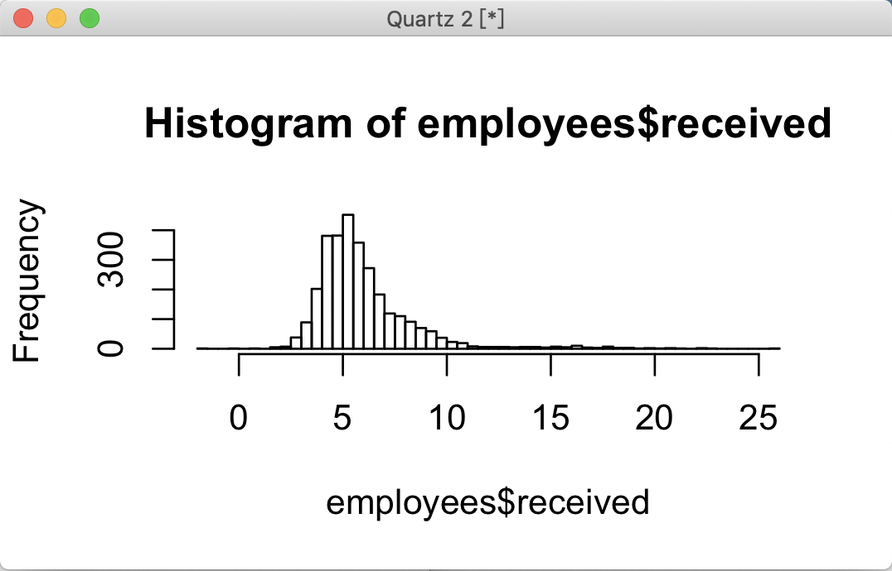

Table of Contents
=================

   * [Operation](#operation)
      * [1.1 Mac安装使用Mysql教程(从零开始)](#11-mac安装使用mysql教程从零开始)
         * [1.1.1 安装MySQL](#111-安装MySQL)  
         * [1.1.2 安装数据库管理软件DBeaver](#112-安装数据库管理软件DBeaver)  
         * [1.1.3 DBeaver创建MySQL数据库](#113-DBeaver创建MySQL数据库)
         * [1.1.4 MySQL基本操作总结](#114-MySQL基本操作总结)  
            * [检索数据排序](#检索数据排序)
            * [数据过滤](#数据过滤)  
            * [汇总数据](#汇总数据)  
            * [数据分组](#数据分组)  
            * [使用子查询](#使用子查询)
            * [联结表](#联结表)  
            * [组合查询](#组合查询)
            * [插入数据](#插入数据)  
            * [删除更新数据](#删除数据)  
            * [创建和操纵表](#创建和操纵表)  
            * [使用视图](#使用视图)  
            * [使用存储过程](#使用存储过程)

              
         * [1.1.5 参考](#115-参考)
      * [1.2 Mac安装并使用R](#12-mac安装并使用r)
         * [1.2.1 前言](#121-前言)
         * [1.2.2 安装](#122-安装)
         * [1.2.3 使用](#123-使用)
            * [直方图](#直方图)  
            * [线图](#线图)  
            * [整理数据](#整理数据)
            * [导入数据](#导入数据)  
            * [导出文件](#导出文件) 
         * [1.2.4 参考](#124-参考)  
      

# <center>Operation</center>
学习数据分析当中一些操作的总结分析
## <div id="11-mac安装使用mysql教程从零开始">1.1 Mac安装使用Mysql教程(从零开始)</div>
  
### <div id="111-安装MySQL">1.1.1 安装Mysql</div>
&nbsp;&nbsp;&nbsp;&nbsp;&nbsp;&nbsp;&nbsp;Mysql已经在博客[《Concept_Database》](/Users/ruogulu/Desktop/Study/DataAnalysis/Concept.md)中进行过讲解，这里不做赘述，直接安装。
	1. 访问 [MySQL官网下载页](https://dev.mysql.com/downloads/mysql/) 并下载MySQL，详情见下图：  

<center>图1-1.进入官网</center>	  
  
<center>图1-2.下载</center> 
	2. 双击安装包`mysql-8.0.16-macos10.14-x86_64.dmg` ，之后开始安装过程，一直点击`继续`就好，详情见下图：  
		  
		<center>图1-3.继续</center> 
		
		<center>图1-4.加密方式</center> 
		  
		<center>图1-5.设置密码</center>
		  
		<center>图1-6.完成</center>
	3. 检验安装，打开系统偏好设置，可以看到MySQL安装成功，详情见下图：
	  
	<center>图1-7.系统偏好设置</center>  
	  
	<center>图1-8.启动MySQL</center>  
	  
	<center>图1-9.查看MySQL路径设置</center>
	4. MySQL已经安装完毕，接下来要将它与终端连接，详情见下图：  
	添加MySQL运行路径：
	`$ PATH="$PATH":/usr/local/mysql/bin`  
	查看是否添加成功：  
	`$ which mysql`  
	成功则显示：  
	`/usr/local/mysql/bin/mysql`  
	登录MySQL：  
	`$ mysql -u root -p`  
	回车后要求输入密码，我正确输入密码后出现报错：  
	`ERROR 2002 (HY000): Can't connect to local MySQL server through socket '/tmp/mysql.sock' (2)`  
	这是由于我没有第3步将MySQL打开，打开MySQL，重新输入并回车，顺利登录MySQL：  
	  
	<center>图1-10.MySQL连接终端</center>
  
### <div id="112-安装数据库管理软件DBeaver">1.1.2 安装数据库管理软件DBeaver</div>
 
1. 访问 [DBeaver官网下载页](https://dev.mysql.com/downloads/mysql/) 并下载DBeaver，详情见下图：  
  
	<center>图2-1.下载</center>  
 
2. 下载完成后直接双击安装包进行安装，一直点继续就好；  
3. 安装完毕后在启动台找到DBeaver并打开，将其连接数据库（打开后会自动提示连接数据库），详情见下图：  
   
	<center>图2-2.连接数据库</center>  
  
	<center>图2-3.连接设置</center>  
	 
4. 连接MySQL数据库完毕后，会提示是否建立一个数据库，我嫌自己建数据库麻烦，所以就同意建立了一个数据库，方便自己尽快尝试SQL操作，上述操作完毕后的DBeaver如下：  
  
	 <center>图2-4.DBeaver</center>  
	 
&nbsp;&nbsp;&nbsp;&nbsp;&nbsp;&nbsp;&nbsp;初步安装使用MySQL顺利完成，接下来可以愉快地学习SQL了。我会在以后博客中持续记录自己学习SQL的心得。
  
### <div id="113-DBeaver创建MySQL数据库">1.1.3 DBeaver创建MySQL数据库</div>
1. 启动MySQL数据库，具体见[]()图1-8；  
2. 打开DBeaver,在窗口左侧查看已连接数据库列表，查看是否有带有"localhost"的选项（图1-1），如果有则跳到第4步；  
  
	<center>图3-1.本地服务器</center>
	
3. 创建localhost：在以连接数据列表中右键选择“creat连接”（图1-6），之后步骤和[安装数据库管理软件DBeaver]()中第3步之后一样；
	> loclahost指本地数据库服务器，它不会解析成ip，也不会占用网卡、网络资源，不受网络防火墙和网卡相关的的限制。  
4. 双击有"localhost"的选项（此时可能会出现报错，见下文[出现问题及解决](#出现问题及解决)），展开之后右键"数据库"，选择新建数据库（图1-2）；  
  
	<center>图3-2.创建数据库</center>
	  
5. 将数据库命名为自己想要的名字；
6. 若数据库有中文，Charset最好选为gbk，若无则保持默认；
7. 点击“确定”，MySQL数据库创建完毕。  
<div id="出现问题及解决">**出现问题及解决：**

`Public Key Retrieval is not allowed`
	  
&nbsp;&nbsp;&nbsp;&nbsp;&nbsp;&nbsp;&nbsp;该报错表示不允许客户端从服务器获取公钥。可以通过修改驱动属性`allowPublicKeyRetrieval=true`来解决该问题，详情见下图：
	  
  
	<center>图3-3.编辑连接</center> 
	 
  
	<center>图3-4.PublicKeyRetrieval属性</center>   
	  
`No timezone mapping entry for '自动检测'`
	  
&nbsp;&nbsp;&nbsp;&nbsp;&nbsp;&nbsp;&nbsp;该报错表示服务器时区有问题。一样通过修改驱动属性来解决该问题，详情见下图：
	  
 
    <center>图3-5.timezone属性</center>
    
### <div id="114-MySQL基本操作总结">1.1.4 MySQL基本操作总结</div>
&nbsp;&nbsp;&nbsp;&nbsp;&nbsp;&nbsp;&nbsp;本文是关于MySQL基本操作的总结，也是《SQL必知必会》这本书的读书笔记，将自认为的其中重要知识点摘抄总结出来。以下图所示五个表格为例进行展示与介绍。

<div align="center">
<figure class="half">
    
    
    <center>图4-1.表格Orders和Customers</center>
</figurer>
</div>

<div align="center">
<figure class="half">
    
    
    <center>图4-2.表格Products和Vendors</center>
</figurer>
</div>
 
<center>
    
</center>  
<center>图4-3.表格OrderItems</center>
MySQL中的基本操作主要为选择，插入，删除和更新四种，对应代码为`SELECT`，`INSERT`，`DELETE`和`UPDATE`。

+ **<div id="检索数据排序">检索数据排序</div>**  
  
1. 单列排序
 
 ```
 SELECT prod_name
 FROM Products
 ORDER BY prod_name;
 ```  
 &nbsp;&nbsp;&nbsp;&nbsp;&nbsp;&nbsp;&nbsp;将检索出的 prod\_name 数据根据 prod\_name进行排序。  

2. 多列排序
 
 ```SQL
 SELECT prod_id, prod_price, prod_name
 FROM Products
 ORDER BY prod_price, prod_name
 ```  
 &nbsp;&nbsp;&nbsp;&nbsp;&nbsp;&nbsp;&nbsp;将检索出的数据 prod\_id，prod\_price，prod\_name先根据 prod_price 排序，如果有产品的价格相同则再根据 prod_name 进行排序。
 
3. 按列相对位置排序  
 
 ```SQL
 SELECT prod_id, prod_price, prod_name
 FROM Products
 ORDER BY 2, 3;
 ```
 &nbsp;&nbsp;&nbsp;&nbsp;&nbsp;&nbsp;&nbsp;用 SELECT 中列名的相对位置代替多列排序中 ORDER BY 后面的列名，依然遵循多列排序的规则。  
 
4. 降序排列  

 ```SQL
 SELECT prod_id, prod_price, prod_name
 FROM Products
 ORDER BY prod_price DESC, prod_name;
 ```  
 &nbsp;&nbsp;&nbsp;&nbsp;&nbsp;&nbsp;&nbsp;一般默认进行升序排列，要降序排列时，只需在进行排序的列名后添加语句`DESC`，多列降序排列时则在每一列后面都添加语句`DESC`。  
 
+ **<div id="数据过滤">数据过滤</div>**  
  

+ **<div id="汇总数据">汇总数据</div>**  
&nbsp;&nbsp;&nbsp;&nbsp;&nbsp;&nbsp;&nbsp;有时不需要实际的数据本身，而需要汇总表中数据。这时就需要聚集函数来实现数据汇总，各种数据库对聚集函数的实现都非常一致。五种常用的聚集函数如下所示：  

1. 返回某列的平均值
   
 ```
 ELECT AVG(prod_price) AS avg_price
 FROM Products
 WHERE vend_id = 'DLL01';  # 添加`where`子句对特定若干行或列求均值
 ```  
 **注意**：  
 NULL值：自动忽略。  
  
2. 返回某列最小值  

 ```
 SELECT MAX(prod_price) 
 AS max_price
 FROM Products;
 ```  
 **注意**：  
 NULL值：自动忽略；  
 文本列：返回按列排序的最后一行。  
 
3. 返回最大值  

 ```
 SELECT MIN(prod_price) 
 AS max_price
 FROM Products;
 ```  

4. 返回某列行数  

 ```
 SELECT COUNT(*) AS num_cust
 FROM Customers;
 ```  
 **注意**：  
 NULL值：COUNT(*)不会忽略，统计表中所有行；但COUNT(COLUMN)会忽略。  
 
5. 对某列值求和  
 
 ```
 SELECT SUM(item_price*quantity) 
 AS total_price
 FROM OrderItems
 WHERE order_num = 20005;
 ```  
 **注意**：
 NULL值：自动忽略。

6. 聚集不同值  
  + 当指定 ALL 或不指定时，包含所有行。
  2. 当指定 DISTINCT 时，只包含不同的值。  

+ **<div id="数据分组">数据分组</div>**  
&nbsp;&nbsp;&nbsp;&nbsp;&nbsp;&nbsp;&nbsp;聚集函数是在表的所有数据或匹配where子句的数据上进行计算，当要将数据划分为若干组且对每个组分别进行聚集函数计算时，仅有聚集函数是不够的，还要进行分组。  
 
1. 创建分组`GROUP BY`
  	
  	```
   SELECT vend_id, prod_price, COUNT(*) AS num_prods
   FROM Products
   GROUP BY vend_id, prod_price;
   ```
   **注意**：
       
    + GROUP BY子句可以包含任意数目的列，因而可以进行嵌套分组，具体方式见上面的例子；
    + GROUP BY子句中的列必须是检索列或有效的表达式（但不能是聚集函数）；
    + SELECT语句中的每一列都必须在GROUP BY子句中出现；
    + 大多数SQL不允许GROP BY列带有可变长度的数据类型（如文本或备注型字段）；
    + NULL：会被当作一个单独的分组列出；
    + GROUP BY一定在WHERE子句之后，ORDER BY子句之前；  
2. 过滤分组`HAVING`  
之前的WHERE子句只可以过滤行，要过滤分组时需要使用HAVING子句。
  
  ```
  SELECT cust_id, COUNT(*) AS orders
  FROM Orders
  GROUP BY cust_id
  HAVING COUNT(*) >= 2;
  ```
  **注意**：
       
    + WHERE 在数据分组前进行过滤，HAVING 在数据分组后进行过滤；
    + 所有类型的WHERE子句都可以用HAVING子句来代替（HAVING支持所有的WHERE操作符）；

+ **<div id="使用子查询">使用子查询</div>**  
&nbsp;&nbsp;&nbsp;&nbsp;&nbsp;&nbsp;&nbsp;SELECT语句只可以查询单个数据表，但有时需根据若干数据表查询数据，此时可以创建子查询（subquery）进行查询。
 1. 使用子查询过滤  
 *例子*：  
 需要列出订购物品 RGAN01 的所有顾客？  
 *解答*：  
 (1) 检索包含物品 RGAN01 的所有订单的编号。  
 (2) 检索具有前一步骤列出的订单编号的所有顾客的 ID。  
 (3) 检索前一步骤返回的所有顾客 ID 的顾客信息。  
 上诉操作需检索三张表，分别为 OrderItems, Orders和 Customers。  
 *硬查询*：  
 先执行步骤（1）
    
     ```
     SELECT order_num
     FROM OrderItems
     WHERE prod_id = 'RGAN01';
     ``` 
 再执行步骤（2）：  
 
     ```
     SELECT cust_id
     FROM Orders
     WHERE order_num IN (20007,20008); 
     ```
 第（3）步与前两步类似，不再赘述。  
 *子查询*：  
 把一条 SELECT 语句返回的结果嵌套入另一条SELECT 语句中的 WHERE 子句。
 
      ```
      SELECT cust_name, cust_contact
      FROM Customers
      WHERE cust_id IN(SELECT cust_id
                       FROM Orders
                       WHERE order_num IN(SELECT order_num
                                          FROM OrderItems
                                          WHERE prod_id = 'RGAN01'));
     ```
     
      **注意**
  
      + 作为子查询的 SELECT 语句只能查询单个列。企图检索多个列将返回 错误；
      + 使用子查询并不总是执行上诉数据检索的最有效方法；  
 
 2. 作为计算字段使用子查询  
 *例子*：  
 显示 Customers 表中 每个顾客的订单总数  
 *解答*：  
 (1) 从 Customers 表中检索顾客列表；  
 (2) 对于检索出的每个顾客，统计其在 Orders 表中的订单数目；  
 上诉操作需检索两张表，分别为 Orders 和 Customers。  
    
     ```
     SELECT cust_name,
            cust_state,
           (SELECT COUNT(*)
            FROM Orders
            WHERE Orders.cust_id = Customers.cust_id) AS orders
     FROM Customers
     ORDER BY cust_name;
     ``` 
  **注意**  
    
   + 子查询中的 WHERE 子句使用了完全限定列名，指定表名和列名 (Orders.cust_id 和  Customers.cust_id），而不只是列名。
   + 完全限定列名可以避免歧义，在 SELECT 语句中操作多个表就应使用完全限定列名来避免歧义。  
  
+ **<div id="联结表">联结表</div>**  
 1. 联结  
用于在一条SELECT语句中关联多个表的机制。它并不是物理实体，DBMS会根据需要建立联结。
  
 2. 创建联结  
 指定要联结的表以及它们的联结方式即可。
    
     ```
     SELECT vend_name, prod_name, prod_price
     FROM Vendors, Products
     WHERE Vendors.vend_id = Products.vend_id;
     ```  
 *叉联结*  
 如果没有 WHERE 子句，结果为两个表的笛卡尔积（叉联结），即结果的行数是被 查询表的行数的乘积。  
 *内联结*  
 之前的联结都可称为等值联结，它基于两个表之间的相等测试，也称为内联结。可以 用不同的语法明确指定联结类型，之前的语句可改写如下：  
     
     ```
     SELECT vend_name, prod_name, prod_price
     FROM Vendors INNER JOIN Products
     ON Vendors.vend_id = Products.vend_id;
     ```  
 *联结多个表*  
  同样指定要联结的表以及各表之间的联系，具体如下：  
     
     ```
     SELECT prod_name, vend_name, prod_price, quantity 
     FROM OrderItems, Products, Vendors
     WHERE Products.vend_id = Vendors.vend_id
     AND OrderItems.prod_id = Products.prod_id
     AND order_num = 20007;
     ```  
  
   **注意**：  
    
  + 不要联结不必要的表，联结表越多，性能下降越厉害。
  
+ **<div id="高级联结">高级联结</div>**   
  1. 使用表别名  
  ``原始表名 AS 表别名``  
  **注意**：  
  Oracle 中没有AS，所以直接用 ``原始表名 表别名`` 的方式创建表别名。
  
  2. 使用不同类型的联结  
  &nbsp;&nbsp;&nbsp;&nbsp;&nbsp;&nbsp;&nbsp;之前使用的都是内联结或等值联结等简单联结。除此之外还有自联结，自然联结和外联结。  
  **自联结**  
  &nbsp;&nbsp;&nbsp;&nbsp;&nbsp;&nbsp;&nbsp;*自联结即为表自己和自己联结，一般比使用查询要快。*  
   
     ```
     SELECT C1.cust_id, C1.cust_name, C1.cust_contact
     FROM Customers AS C1, Customers AS C2
     WHERE C1.cust_name=C2.cust_name
     AND C2.cust_contact= "Jim Jones";
     ```   
  **自然联结**  
  &nbsp;&nbsp;&nbsp;&nbsp;&nbsp;&nbsp;&nbsp;*使用明确子集表示表的某一列，保证它只在结果中出现一次。迄今为止建立的每个内联结都是自然联结，很可能永远都不会用到不是自然联结的内联结。*  
  **外联结**  
  &nbsp;&nbsp;&nbsp;&nbsp;&nbsp;&nbsp;&nbsp;*之前的联结中，一个表中的行必定与另一个表中的一行相关联对应，但有时也需要包含没有关联行的行，此时需要使用外联结。*  
     
     ```
     SELECT Customers.cust_id, Orders.order_num
     FROM Customers LEFT OUTER JOIN Orders
     ON Customers.cust_id = Orders.cust_id;
     ```  
  外联结使用关键字 OUTER JOIN 实现包含无关联行的行。使用 `OUTER JOIN` 语法时，必须使用 `RIGHT` 或 `LEFT` 关键字指定包括其所有行的表(`RIGHT` 指出的是 `OUTER JOIN` 右边的表，而 `LEFT` 指出的是 `OUTER JOIN` 左边的表)。此外还有一种全外联结（`FULL OUTER JOIN`），它检索两个表中 的所有行并关联那些可以关联的行（但Access、MariaDB、MySQL、Open Office Base 和 SQLite 不支持该外联结语法）。  
  **使用带聚集函数的联结**  
     
     ```
     SELECT Customers.cust_id, 
            COUNT(Orders.order_num) AS num_ord
     FROM Customers INNER JOIN Orders
     ON Customers.cust_id = Orders.cust_id
     GROUP BY Customers.cust_id;
     ```    
 
+ **<div id="组合查询">组合查询</div>**  
  **组合查询**  
  &nbsp;&nbsp;&nbsp;&nbsp;&nbsp;&nbsp;&nbsp;进行组合查询有两种情况，第一种为对一个表进行多个查询，然后按一个查询返回结果；第二种为一个查询中从多个表返回结果。
  
  **创建组合查询**  
  &nbsp;&nbsp;&nbsp;&nbsp;&nbsp;&nbsp;&nbsp;可以通过两种方式创建组合查询，第一种使用多个WHERE子句；第二种为使用关键字UNION连接两个查询。具体见如下代码：  
  
    ```  
    问题：需要 Illinois、Indiana 和 Michigan 等美国几个州的所有顾 客的报表，还想包括不管位于哪个州的所有的 Fun4All。  
    解答：
    SELECT cust_name, cust_contact, cust_email
    FROM Customers
    WHERE cust_state IN ('IL','IN','MI')
    UNION
    SELECT cust_name, cust_contact, cust_email
    FROM Customers
    WHERE cust_name = 'Fun4All';
    或
    SELECT cust_name, cust_contact, cust_email
    FROM Customers
    WHERE cust_state IN ('IL','IN','MI')
    OR cust_name = 'Fun4All';
    ```  
  
  **UNION规则**  
    
   1. UNION必须包含两个或两个以上的SELECT语句，且用UNION分隔；
   2. UNION中每个查询的列名，表达式，聚集函数必须相同，但列名出现顺序可以不同（亲自实践发现在MySQL中列名不同也不会报错，但组合不同的列名显然无意义，具体例子见[操作多个表]()）；
   3. UNION中列数据类型必须兼容，列数据类型不一定完全相同，但必须是DBMS可以隐含转换的类型。  
  
  **保留或取消重复的行**  
 &nbsp;&nbsp;&nbsp;&nbsp;&nbsp;&nbsp;&nbsp;UNION默认为取消重复的行，如果要保留重复的行则将`UNION`改为`UNION ALL`。
  
  **组合查询结果排序**  
 &nbsp;&nbsp;&nbsp;&nbsp;&nbsp;&nbsp;&nbsp;UNION查询中只允许使用一个`ORDER BY`子句，并且必须在最后一个SELECT语句之后。  
  
  **<div id="操作多个表">操作多个表</div>**
 &nbsp;&nbsp;&nbsp;&nbsp;&nbsp;&nbsp;&nbsp;之前的例子为对一个表查询多次，UNION连接多个表的查询如下：  
   
   ```
   SELECT cust_name, cust_contact, cust_email
   FROM Customers
   WHERE cust_state IN ('IL','IN','MI')
   UNION
   SELECT order_num, order_item, prod_id
   FROM OrderItems
   WHERE prod_id = 'RGAN01';  
   cust_name    |cust_contact|cust_email
   结果为  
   cust_name    |cust_contact|cust_email           |
   -------------|------------|---------------------|
   Village Toys |John Smith  |sales@villagetoys.com|
   Fun4All      |Jim Jones   |jjones@fun4all.com   |
   The Toy Store|Kim Howard  |                     |
   20007        |5           |RGAN01               |
   20008        |1           |RGAN01               | 
   ```
   
   两个表查询的列名并不相同，但也会强制将两个查询的结果组合在一起，但没什么意义。  

+ **<div id="插入数据">插入数据</div>**  
  **插入整行数据**
     
  ```
  INSERT INTO Customers
  VALUES('1000000006',
           'Toy Land',
           '123 Any Street',
           'New York',
           'NY',
           '11111',
           'USA',
            NULL,
            NULL);   
  ```  
  &nbsp;&nbsp;&nbsp;&nbsp;&nbsp;&nbsp;&nbsp;由于无法保证表结构改变后，各列次序依然保持不变，所以上述方式并不安全，采取以下方式虽然麻烦但更加安全：  
  
  ```
  INSERT INTO Customers(cust_id,
                          cust_name,
                          cust_address,
                          cust_city,
                          cust_state,
                          cust_zip,
                          cust_country,
                          cust_contact,
                          cust_email)
  VALUES('1000000006',
           'Toy Land',
           '123 Any Street',           
           'New York',
           'NY',
           '11111',
           'USA',
            NULL,
            NULL);
  ```  
  **插入行的一部分**  
  &nbsp;&nbsp;&nbsp;&nbsp;&nbsp;&nbsp;&nbsp;插入行的一部分和插入完整行的用法其实差不多，只不过在插入行一部分时未插入值的列名不会写出。  
    
    ```
    INSERT INTO Customers(cust_id,
                          cust_name,
                          cust_address,
                          cust_city,
                          cust_state,
                          cust_zip,
                          cust_country)  
    VALUES('1000000008',
           'CF Land',
           '321 Tic Avenue',
           'Shanghai',
           'SH',
           '18484',
           'CCP');
    ```
   
   注意：  
   1. 省略列时列定义要允许NULL值（空值或无值）
   2. 表定义有默认值，表示若不给处值时将使用默认值。  
   
   **插入查询结果**  
   &nbsp;&nbsp;&nbsp;&nbsp;&nbsp;&nbsp;&nbsp;如果希望将另一个表中的顾客列插入Customer表中就需要使用 INSERT SELECT 语句，即一条 INSERT 语句再加一条 SELECT 语句。  
   
   ```
   INSERT INTO Customers(cust_id,
                          cust_name,
                          cust_address,
                          cust_city,
                          cust_state,
                          cust_zip,
                          cust_country)
   SELECT cust_id,
           cust_call,
           cust_place,
           cust_town,
           cust_province,
           cust_code,
           cust_nation
   FROM CustNew;
   ```  
   **从一个表复制到另一个表**  
   &nbsp;&nbsp;&nbsp;&nbsp;&nbsp;&nbsp;&nbsp;有一种数据插入不使用 INSERT，即将一个表的内容复制到另一个全新的表中，此时使用 SELECT INTO 语句。不同 DBMS 对 SELECT INTO 的支持度也不同，DB2不支持 SELECT INTO，SQL Server 使用 SELECT INTO 的语法为：  
   
   ```
   SELECT *
   INTO CustCopy
   FROM Customers;
   ```  
   而 MariaDB、MySQL、Oracle、PostgreSQL和SQLite 使用的语法如下：  
   
   ```
   CREATE TABLE CUstCopy AS
   SELECT * FROM Customers;
   ```  
   
+ **<div id="删除数据">删除更新数据</div>**
  **更新数据**  
  &nbsp;&nbsp;&nbsp;&nbsp;&nbsp;&nbsp;&nbsp;可以使用UPDATE语句更新表中数据。基本的UPDATE语句由如下三部分组成：  
  + 要更新的表
  + 列名和新值
  + 要更新行的过滤条件  
  
  &nbsp;&nbsp;&nbsp;&nbsp;&nbsp;&nbsp;&nbsp;更新特定行，用 WHERE 指定行：  
    
    ```
    UPDATE Customers
    SET cust_email = 'kim@thetoystore.com'
    WHERE cust_id = '1000000005';  #如果没有 WHERE 则默认更新所有行
    ```  
    
   &nbsp;&nbsp;&nbsp;&nbsp;&nbsp;&nbsp;&nbsp;更新多个列，SET 子句中添加多个"列=值"对，并用逗号分隔：  
   
   ```
   UPDATE Customers
   SET cust_email = 'sam@toyland.com',
       cust_contact = 'Sam Roberts'
   WHERE cust_id = '1000000006';
   ```  
   
   **删除数据**  
   &nbsp;&nbsp;&nbsp;&nbsp;&nbsp;&nbsp;&nbsp;使用 DELETE 语句即可，DELETE 语句由如下两部分组成；  
   
   + DELETE FROM 指定要删除的表
   + WHERE 指定要删除的特定行（如果没有 WHERE 则会删除整个表的数据，但不会删除表）  
   
   &nbsp;&nbsp;&nbsp;&nbsp;&nbsp;&nbsp;&nbsp;删除顾客ID为1000000006的那一行：
   
   ```
   DELETE FROM Customers
   WHERE cust_id = '1000000006';
   ```  
   
   **更新和删除的指导原则**  
   
   + 除非确实打算更新和删除每一行，否则绝对不要使用不带 WHERE 子句 的 UPDATE 或 DELETE 语句。
   + 保证每个表都有主键(如果忘记这个内容，请参阅第 12 课)，尽可能 像 WHERE 子句那样使用它(可以指定各主键、多个值或值的范围)。
   + 在 UPDATE 或 DELETE 语句使用 WHERE 子句前，应该先用 SELECT 进 行测试，保证它过滤的是正确的记录，以防编写的 WHERE 子句不正确。
   + 使用强制实施引用完整性的数据库(关于这个内容，请参阅第 12 课)，这样 DBMS 将不允许删除其数据与其他表相关联的行。
   + 有的 DBMS 允许数据库管理员施加约束，防止执行不带 WHERE 子句 的 UPDATE 或 DELETE 语句。如果所采用的 DBMS 支持这个特性，应该使用它。  

+ **<div id="创建和操纵表">创建和操纵表</div>**  
   **创建表**  
   &nbsp;&nbsp;&nbsp;&nbsp;&nbsp;&nbsp;&nbsp;创建表有两种方法，第一种是通过DBMS工具创建，第二种是通过SQL语句创建。  
    1. 创建基础表  
    &nbsp;&nbsp;&nbsp;&nbsp;&nbsp;&nbsp;&nbsp;使用CREATE TABLE语句创建表，其中包含如下三个要素：  
     + 表名，在CREATE TABLE语句之后；
     + 列名及其定义，用逗号分隔；
     + 有的DBMS还要求指定表的位置；  
    
     ```
     CREATE TABLE MyFirstTable
     (my_id  char(10)  NOT NULL,
     my_name  char(10) NOT NULL,
     my_age char(10) NOT NULL,
     my_note char(10) NOT NULL
     );
     ```  
   2. 使用NULL  
     + 在不指定NOT NUUL时，多数DBMS默认指定的是NULL,但有的DBMS要求指定NULL，否则报错；
     + 只有NOT NULL的列允许指定为主键；
     + NULL与空字符串不同，空字符串是一个有效的值，而NULL是无值；  
   
   3. 使用默认值  
   &nbsp;&nbsp;&nbsp;&nbsp;&nbsp;&nbsp;&nbsp;在CREATE TABLE语句的列定义中用关键字DEFAULT指定默认值，默认值一般用于时间日期列，而不同DBMS获取系统日期的命令往往不同，下表列出了不同DBMS的用法：  
   
   |DBMS          |函数           |   
   |:---------:   |:-----:        |    
   |MySQL         |CURRENT_DATE() |  
   |SQL Server    |GETDATE()      |
   |Oracle        |SYSDATE        |
   |Acess         |NOW            |
   |DB2           |CURRENT_DATE() |
   |PostgreSQL    |CURRENT_DATE() |
   |SQLite        |date('now')    |
   
   ```
   CREATE TABLE MyFirstTable
     (my_id  char(10)  NOT NULL,
     my_name  char(10) NOT NULL,
     my_date char(10) DEFAULT CURRENT_DATE,
     my_note char(10) NOT NULL
     );

   ```  
   
  **更新表**  
   
   1. 注意事项：  
     
     + 理想情况下，不要在表中包含数据时对其进行更新。应该在表的设 计过程中充分考虑未来可能的需求，避免今后对表的结构做大 改动。
     + 所有的 DBMS 都允许给现有的表增加列，不过对所增加列的数据类型 (以及 NULL 和 DEFAULT 的使用)有所限制。
     + 许多 DBMS 不允许删除或更改表中的列。
     + 多数 DBMS 允许重新命名表中的列。
     + 许多 DBMS 限制对已经填有数据的列进行更改，对未填有数据的列几乎没有限制。  
   
   2. 语法：  
   &nbsp;&nbsp;&nbsp;&nbsp;&nbsp;&nbsp;&nbsp;更新表的语法与创建表的语法比较相似：  
     + 表名，在ALTER TABLE语句之后；  
     + 说明列要做出哪些修改。  
     
     ```
     # 添加列
     ALTER TABLE Vendors
     ADD vend_phone CHAR(20);
     # 删除列
     ALTER TABLE Vendors
     DROP COLUMN vend_phone;
     ```  
     
   3. 复杂更新：  
   &nbsp;&nbsp;&nbsp;&nbsp;&nbsp;&nbsp;&nbsp;复杂的表结构更新，一般需要手动删除过程，具体如下：  
   (1) 用新的列布局创建一个新表;  
   (2) 使用 INSERT SELECT 语句(关于这条语句的详细介绍，请参阅第 15课)从旧表复制数据到新表。有必要的话，可以使用转换函数和计算字段;  
   (3) 检验包含所需数据的新表;  
   (4) 重命名旧表(如果确定，可以删除它);  
   (5) 用旧表原来的名字重命名新表;  
   (6) 根据需要，重新创建触发器、存储过程、索引和外键。  
  
  **删除表**  
  &nbsp;&nbsp;&nbsp;&nbsp;&nbsp;&nbsp;&nbsp;使用 DROP TABLE 语句就可以直接删除表（整个表而不是其内容）：```DROP TABLE MySecondTable;```  
  
  &nbsp;&nbsp;&nbsp;&nbsp;&nbsp;&nbsp;&nbsp;注意事项：  
  
   + 删除表没有确认，也不能撤销，执行这条语句将永久删除该表；
   + 许多DBMS不允许删除于其它表相关联的表；  
   
  **重命名表**  
  &nbsp;&nbsp;&nbsp;&nbsp;&nbsp;&nbsp;&nbsp;重命名操作不存在严格标准：  
  
  + DB2、MariaDB、MySQL、Oracle 和 PostgreSQL 用户使用 RENAME 语句；
  + SQL Server 用户使用 sp_rename 存储过程；
  + SQLite 用户使用 ALTER TABLE 语句。  
  具体语法可参见相应的DBMS文档。  
  
+ **<div id="使用视图">使用视图</div>**  
  **视图**  
  &nbsp;&nbsp;&nbsp;&nbsp;&nbsp;&nbsp;&nbsp;视图是虚拟的表，只包含使用时动态检索数据的查询，与包含数据的表不同。并且需要注意Access无法使用视图，SQLite仅支持可读视图。  
  1. 为什么使用视图  
    
     + 简化复杂的 SQL 操作。在编写查询后，可以方便地重用它而不必知道 其基本查询细节；
     + 使用表的一部分而不是整个表；
     + 保护数据。可以授予用户访问表的特定部分的权限，而不是整个表的访问权限；
     + 更改数据格式和表示。视图可返回与底层表的表示和格式不同的数据。    
 
  2. 视图的规则和限制  
     
     + 与表一样，视图必须唯一命名(不能给视图取与别的视图或表相同的 名字)；  
     + 对于可以创建的视图数目没有限制；  
     + 创建视图，必须具有足够的访问权限。这些权限通常由数据库管理人员授予。  
     + 视图可以嵌套，即可以利用从其他视图中检索数据的查询来构造视图。所允许的嵌套层数在不同的 DBMS 中有所不同(嵌套视图可能会 严重降低查询的性能，因此在产品环境中使用之前，应该对其进行全 面测试)；  
     + 许多DBMS禁止在视图查询中使用ORDER BY子句；  
     + 有些 DBMS 要求对返回的所有列进行命名，如果列是计算字段，则需要使用别名(关于列别名的更多信息，请参阅第 7 课)。  
     + 视图不能索引，也不能有关联的触发器或默认值。  
     + 有些 DBMS 把视图作为只读的查询，这表示可以从视图检索数据，但不能将数据写回底层表。详情请参阅具体的 DBMS 文档。  
     + 有些 DBMS 允许创建这样的视图，它不能进行导致行不再属于视图的 插入或更新。例如有一个视图，只检索带有电子邮件地址的顾客。如果 更新某个顾客，删除他的电子邮件地址，将使该顾客不再属于视图。这是默认行为，而且是允许的，但有的 DBMS 可能会防止这种情况发生。  
       
  **创建视图**  
  
  1. 利用视图简化复杂联结  
     创建视图  
     
     ```
     CREATE VIEW ProductCustomers AS
     SELECT cust_name, cust_contact, prod_id
     FROM Customers, Orders, OrderItems
     WHERE Customers.cust_id = Orders.cust_id
     AND OrderItems.order_num = Orders.order_num;
     ```  
     使用视图  
     
     ```
     SELECT cust_name, cust_contact
     FROM ProductCustomers
     WHERE prod_id = 'RGAN01';
     ```
     
  2. 用视图重新格式化检索出的数据
    
     ```
     CREATE VIEW VendorLocations AS
     SELECT Concat(vend_name, ' (', vend_country, ')')
            AS ven_title
     FROM Vendors;
     ```  
     ```
     SELECT *
     FROM VendorLocations;  
     ```
  
  3. 用视图过滤不想要的数据  

     ```
     CREATE VIEW CustomerEMailList AS
     SELECT cust_id, cust_name, cust_email
     FROM Customers
     WHERE cust_email IS NOT NULL;
     ```
     ```
     SELECT *
     FROM CustomerEMailList;  
     ```
     &nbsp;&nbsp;&nbsp;&nbsp;&nbsp;&nbsp;&nbsp;从视图检索数据时如果使用了一条 WHERE 子句，则两组子句(一组在 视图中，另一组是传递给视图的)将自动组合。
  4. 使用视图与计算字段  

     ```
     CREATE VIEW OrderItemsExpanded AS
     SELECT order_num,
            prod_id,
            quantity,
            item_price,
            quantity*item_price AS expanded_price
     FROM OrderItems;
     ```  
     ```
     SELECT *
     FROM OrderItemsExpanded
     WHERE order_num = 20008;
     ```  
     
+ **<div id="使用存储过程">使用存储过程</div>**  
问题解决思路（结合参考手册）： 

1. 尝试终端创建存储过程；  
[1] GarveyCalvin.[MySQL之终端(Terminal)管理MySQL](https://www.cnblogs.com/GarveyCalvin/p/4297221.html)  
[2] 风亡小窝.[mysql存储过程详细教程](https://www.jianshu.com/p/7b2d74701ccd)
2. 直接谷歌搜索报错语句；
3. 搜索DBeaver创建MySQL存储过程报错；      
     
### <div id="115-参考">1.1.5 参考</div>  
[1] 展菲.[mac 安装mysql详细教程](https://www.jianshu.com/p/07a9826898c0)  
[2] 范聖佑.[第 28 天：安裝/使用 DBeaver 管理資料庫](https://ithelp.ithome.com.tw/articles/10196383)
  
**DBeaver创建MySQL数据库**  
[1] Ben Forta.[SQL必知必会-中文-第4版](https://github.com/Roggu123/DataAnalysis/blob/master/References/SQL必知必会-中文-第4版..pdf)  
[2] Jiezi.[连接 MYSQL 8.X 版本报错解决](https://lequ7.com/2019/04/08/richang/lian-jie-MySQL-8x-ban-ben-bao-cuo-jie-jue/)  
[3] serge-rider.[Timezone and MySQL Connector](https://github.com/dbeaver/dbeaver/issues/3599)  
[4] zyz511919766.[MySQL 中 localhost 与 127.0.0.1 的区别](https://blog.csdn.net/zyz511919766/article/details/21384791)   

**MySQL使用**  
[1] .[MySQL 8.0参考手册](https://dev.mysql.com/doc/refman/8.0/en/) 
  
  
## <div id="12-Mac安装并使用R">1.2 Mac安装并使用R</div>
### <div id="121-前言">1.2.1 前言</div>
由于今后工作可能从事数据分析，所以最近在通过《深入浅出数据分析》这本书进行数据分析的入门学习，书中有一部分内容是用R来进行分析学习，所以我尝试学习了一下R的安装使用，在此记录下来。
### <div id="112-安装">1.2.2 安装</div>  
1. 访问[官网](https://cran.r-project.org/mirrors.html) 并下载R，详情见下图：  
  
<center>图2-1.选择镜像
  
<center>图2-2.选择系统  

<center>图2-3.下载R  

2. 尝试运行一个R脚本，我使用了《深入浅出数据分析》中的R脚本，过程如下：
 + 输入命令  
 `source("http://www.headfirstlabs.com/books/hfda/hfda.R")`  
 + 出现报错  
 `Error in file(filename, "r", encoding = encoding) : 
  cannot open the connection to 'http://www.headfirstlabs.com/books/hfda/hfda.R'
In addition: Warning message:
In file(filename, "r", encoding = encoding) :
  URL 'https://www.oreilly.com/library/view/head-first-data/9780596806224/': status was 'Couldn't connect to server'`  
 或  
 `Error in source("http://www.headfirstlabs.com/books/hfda/hfda.R") : 
  http://www.headfirstlabs.com/books/hfda/hfda.R:1:1: unexpected '<'
1: <
    ^`  
 + 上面的报错指无法连接至脚本所在的服务器和脚本有问题，下载该脚本至本地并打开，脚本内容如下  
 `employees <- read.csv("http://www.headfirstlabs.com/books/hfda/hfda_ch09_employees.csv",header=TRUE)`  
 + 既然脚本无法通过网络连接打开，那么脚本中的网址也应该打不开，下载[csv文件](https://github.com/Roggu123/DataAnalysis/blob/master/hfda_data/hfda.R)并更改脚本  
 `employees <- read.csv("~/Desktop/Study/DataAnalysis/hfda_data/hfda_ch09_employees.csv",header=TRUE)`  
 + 输入`employees`，正确输出csv文件中内容  
   
 + 根据csv文件内容画出直方图`hist(employees$received, breaks=50)`  
   
3. 结果和书中展示的结果相同，R安装成功，初步体验了R的使用，和Matlab有点相似而且不收费，可以继续开心学习了。

### <div id="123-使用">1.2.3 使用</div>  
+ **<div id="直方图">直方图<div>**  
 1. 绘制直方图 `hist(data, breaks)`  
 **data：**表示要绘制的数据；  
 **breaks：**告诉R如何分组，指定格式有多种；
   
		>第一种，给定一个向量，指出不同的断点，如`hist(data,breaks=c(0.5, 1.5, 2.5, 3.5))`；  
第二种，指定分隔好的区间的个数，会根据区间个数自动去计算区>间的大小，如上文所示。  

		**freq：**逻辑值，默认值为TRUE , y轴显示的是每个区间内的频数，FALSE, 代表显示的是频率（= 频数/ 总数），如`hist(data, breaks = 50, freq = F)`  
		**probability：** 逻辑值，和 freq 参数的作用正好相反，TRUE 代表频率， FALSE 代表频数  
		[更多详情](https://www.cnblogs.com/xudongliang/p/6913363.html)  
 2. 保存直方图  

 ```` r
 > png("路径名/图片名.png")
 > hist(data, breaks=50, ...)
 > dev.off()
 ````
 
 + **<div id="线图">线图</div>**
 1. 绘制线图
 `abline(a=NULL, b=NULL, h = NULL, v=NULL, reg=NULL, coef=NULL, untf=FALSE, ol="", ...)`  
**参数解释：**  
参数`a`表示绘制直线的截距；  
参数`b`表示绘制直线的斜率；  
参数`h`表示绘制水平线时的纵轴值；  
参数`v`表示绘制垂直线时的横轴值；  
参数`reg`表示一个回归对象名称，即回归直线的名称；  
参数`coef`是一个二维向量，给出了截距和斜率；
参数`untf`是一个逻辑值，表示是否对数变换，若为TRUE且坐标中至少一个进行了对数变换，则会画出未对数变换前的曲线。  
**示例；**  
在散点图中画出两条直线myLmSmall`y=0.8+0.9x`和myLmBig`y=7.8+0.3x`,输入如下代码：  

			> plot(employees$requested[employees$negotiated == TRUE],  
			employees$received[employees$negotiated==TRUE])  
			> abline(myLmSmall,col="blue")  
			> abline(myLmBig,col="red")  
 			
 	 <center></center>
 		<center>图3-1.线图</center> 			   
   
   2. 保存线图  
 
 		``` r
 		# 和直方图一样  
 		> png("~/Desktop/Study/DataAnalysis/hfda_data/ch11_predict.png")  
 		> plot(employees$requested[employees$negotiated == TRUE],  
 		employees$received[employees$negotiated==TRUE])  
 		> abline(myLmSmall,col="blue")
 		> abline(myLmBig,col="red")
 		> dev.off()
 		``` 

+ **<div id="整理数据">整理数据</div>**  
&nbsp;&nbsp;&nbsp;&nbsp;&nbsp;&nbsp;&nbsp;可以利用正则表达式在**R**中指定复杂的模式以便匹配和替换文本字符串，从而进行数据清理。常用正则表达式指令如下：
 1. 替换字符串
 `新列名 <- sub("被替换字符串(正则表达式模式)"，"替换字符串"，表名$列名)`
 2. 删除某些导致重复的列  
 `表名$列名 <- NULL`
 3. 删除重复名称  
 `列名 <- Unique(列名)`  
 一列当中有些名称发生重复，利用`Unique()`进行删除，重复名称所在的行也会被删除。   
 
 **注意**：  
 在删除重复数据时可以先通过主键对数据进行排序，进一步分析数据重复的原因，然后进行列删除及重复名称删除。
 		 
+ **<div id="导入数据">导入数据</div>**
 1. 导入csv `read.csv(file, header, sep = ",",quote="\"", dec=".",
fill,comment.char="")`  
**参数解释：**   
参数`flie`表示导入文件，为文件绝对或相对路径；  
参数`header`表示是否在文件第一行显示标题，默认为TRUE；  
参数`seq`指定分隔符，默认为空格；参数`quote`表示引号，默认为双引号；  
参数`dec`表示小数点，默认为`.`；  
参数`fill`表示是否填充，即遇到行不相等的情况，空白域自动添加既定值，默认填充；  
参数`comment.char`指定用于表示注释的引导符号。  
**上述参数除了`file`外，一般设定为默认就可以。**  
 2. 导入其它表格  
 `read.table(file, header = FALSE, sep ="", quote = "\"'",
dec = ".", skip = 0,
strip.white = FALSE, blank.lines.skip =TRUE,
comment.char = "#")`  
各参数含义和`read.csv()`差不多。  
+ **<div id="导出文件">导出文件</div>** 
 1. 保存为R文件  
 `save.image("路径名/文件名.RData")`  
 &nbsp;&nbsp;&nbsp;&nbsp;&nbsp;&nbsp;&nbsp;保存为R文件可以保存之前运行时产生的变量数据等，打开之后可以继续上次的运行结果进行操作。
 2. 保存为txt文件  
 &nbsp;&nbsp;&nbsp;&nbsp;&nbsp;&nbsp;&nbsp;直接在界面选择`file -> save as`就可以将代码保存为txt格式，方便详细查看代码，但不会保存之前产生的变量数据，也无法用R打开。
  
### <div id="124-参考">1.2.4 参考</div>  
[1] freewebsys.[R（1）Mac OS 下安装R语言开发环境](https://blog.csdn.net/freewebsys/article/details/45825267)  
[2] 九茶.[R语言的各种报错及其解决方法](https://blog.csdn.net/Bone_ACE/article/details/47324233)  
[3] 方宁.[小白入门R语言时遇到的问题](https://zhuanlan.zhihu.com/p/26352990)  
[4] 庐州月光.[R语言hist绘图函数](https://www.cnblogs.com/xudongliang/p/6913363.html)   
**read.csv用法解析**   
[5] AnneQiQi.[R语言——read.table;read.csv（读取外部数据）](https://blog.csdn.net/AnneQiQi/article/details/51085675)  
**线图**  
[6] 优雅的代码.[在回归方程中可以添加趋势线](http://www.sohu.com/a/252882522_100261403)  
**R的保存**  
[7] 孙洪双.[R学习笔记（一） 变量的保存与加载](https://zhuanlan.zhihu.com/p/29743511)  

  
 