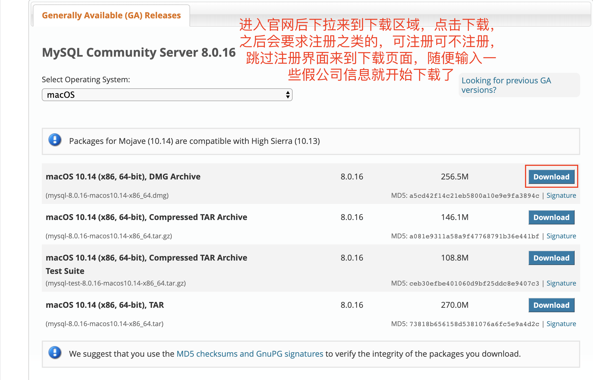
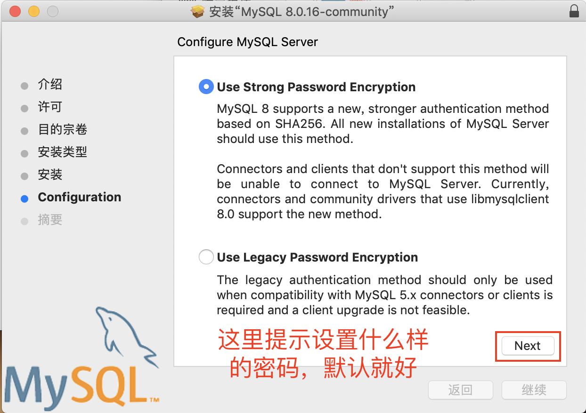
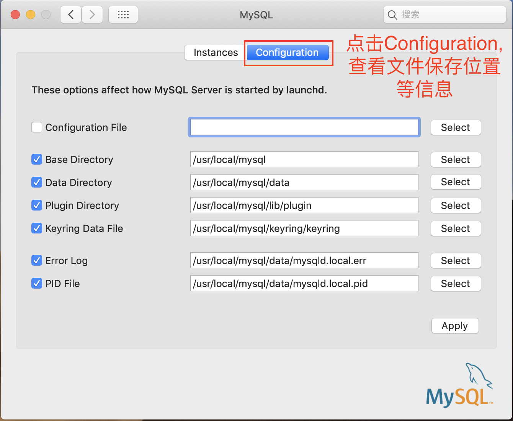
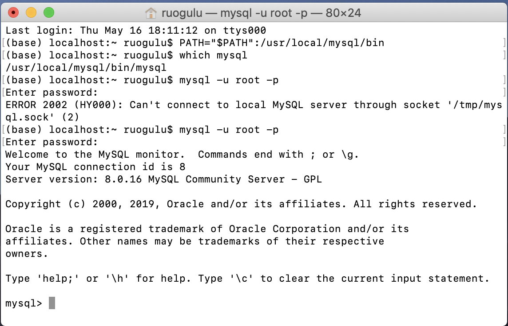
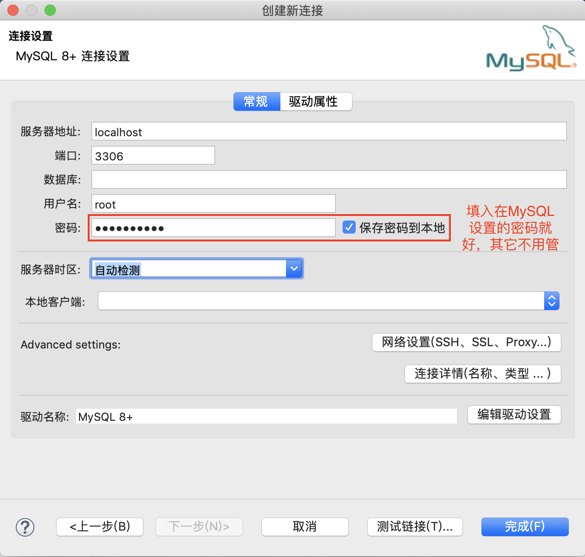
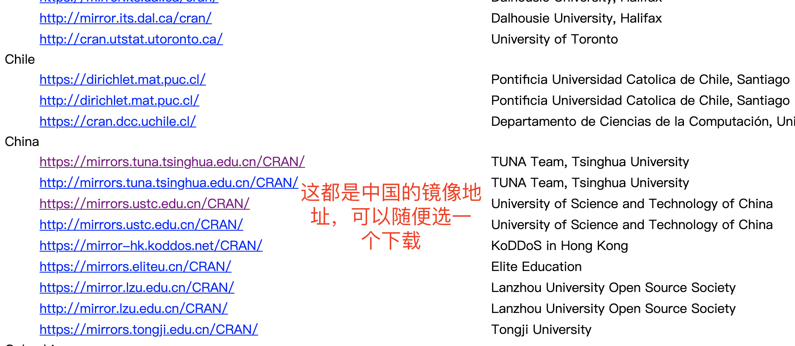
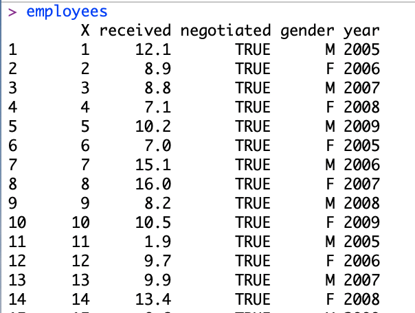

# 
Operation

学习数据分析当中一些操作的总结分析
## 1.1 Mac安装使用Mysql教程(从零开始)  
### 1.1.1 过程记录
+ **安装Mysql：**  
&nbsp;&nbsp;&nbsp;&nbsp;&nbsp;&nbsp;&nbsp;Mysql已经在博客[《Concept_Database》](/Users/ruogulu/Desktop/Study/DataAnalysis/Concept.md)中进行过讲解，这里不做赘述，直接安装。
	1. 访问 [MySQL官网下载页](https://dev.mysql.com/downloads/mysql/) 并下载MySQL，详情见下图：  
	  
  
	2. 双击安装包`mysql-8.0.16-macos10.14-x86_64.dmg` ，之后开始安装过程，一直点击`继续`就好，详情见下图：  
		 
		 
		
		
	3. 检验安装，打开系统偏好设置，可以看到MySQL安装成功，详情见下图：
	  
	  
	. 
	4. MySQL已经安装完毕，接下来要将它与终端连接，详情见下图：  
	添加MySQL运行路径：
	`$ PATH="$PATH":/usr/local/mysql/bin`  
	查看是否添加成功：  
	`$ which mysql`  
	成功则显示：  
	`/usr/local/mysql/bin/mysql`  
	登录MySQL：  
	`$ mysql -u root -p`  
	回车后要求输入密码，我正确输入密码后出现报错：  
	`ERROR 2002 (HY000): Can't connect to local MySQL server through socket '/tmp/mysql.sock' (2)`  
	这是由于我没有第3步将MySQL打开，打开MySQL，重新输入并回车，顺利登录MySQL：  
	
  
+ **安装数据库管理软件DBeaver：**  
	1. 访问 [DBeaver官网下载页](https://dev.mysql.com/downloads/mysql/) 并下载DBeaver，详情见下图：  
	  
	
图1-1.下载
 
	2. 下载完成后直接双击安装包进行安装，一直点继续就好；  
	3. 安装完毕后在启动台找到DBeaver并打开，将其连接数据库（打开后会自动提示连接数据库），详情见下图：  
	   
	
图1-2.连接数据库
  
	  
	
图1-3.连接设置
 
	4. 连接MySQL数据库完毕后，会提示是否建立一个数据库，我嫌自己建数据库麻烦，所以就同意建立了一个数据库，方便自己尽快尝试SQL操作，上述操作完毕后的DBeaver如下：  
	   
	 
图1-4.DBeaver
  
	 
&nbsp;&nbsp;&nbsp;&nbsp;&nbsp;&nbsp;&nbsp;初步安装使用MySQL顺利完成，接下来可以愉快地学习SQL了。我会在以后博客中持续记录自己学习SQL的心得。
  

### 1.1.2 参考  
1. [mac 安装mysql详细教程](https://www.jianshu.com/p/07a9826898c0) 
2. [第 28 天：安裝/使用 DBeaver 管理資料庫](https://ithelp.ithome.com.tw/articles/10196383)  
  
## 1.2 Mac安装并使用R
### 1.2.1 前言
由于今后工作可能从事数据分析，所以最近在通过《深入浅出数据分析》这本书进行数据分析的入门学习，书中有一部分内容是用R来进行分析学习，所以我尝试学习了一下R的安装使用，在此记录下来。
### 1.2.2 过程记录  
1. 访问[官网](https://cran.r-project.org/mirrors.html) 并下载R，详情见下图：  
  

图2-1.选择镜像
  

图2-2.选择系统  

图2-3.下载R  

2. 尝试运行一个R脚本，我使用了《深入浅出数据分析》中的R脚本，过程如下：
 + 输入命令  
 `source("http://www.headfirstlabs.com/books/hfda/hfda.R")`  
 + 出现报错  
 `Error in file(filename, "r", encoding = encoding) : 
  cannot open the connection to 'http://www.headfirstlabs.com/books/hfda/hfda.R'
In addition: Warning message:
In file(filename, "r", encoding = encoding) :
  URL 'https://www.oreilly.com/library/view/head-first-data/9780596806224/': status was 'Couldn't connect to server'`  
 或  
 `Error in source("http://www.headfirstlabs.com/books/hfda/hfda.R") : 
  http://www.headfirstlabs.com/books/hfda/hfda.R:1:1: unexpected '<'
1: <
    ^`  
 + 上面的报错指无法连接至脚本所在的服务器和脚本有问题，下载该脚本至本地并打开，脚本内容如下  
 `employees <- read.csv("http://www.headfirstlabs.com/books/hfda/hfda_ch09_employees.csv",header=TRUE)`  
 + 既然脚本无法通过网络连接打开，那么脚本中的网址也应该打不开，下载[csv文件](https://github.com/Roggu123/DataAnalysis/blob/master/hfda_data/hfda.R)并更改脚本  
 `employees <- read.csv("~/Desktop/Study/DataAnalysis/hfda_data/hfda_ch09_employees.csv",header=TRUE)`  
 + 输入`employees`，正确输出csv文件中内容  
   
 + 根据csv文件内容画出直方图`hist(employees$received, breaks=50)`  
   
3. 结果和书中展示的结果相同，R安装成功，初步体验了R的使用，和Matlab有点相似而且不收费，可以继续开心学习了。
  
### 1.2.3 参考  
1. [R（1）Mac OS 下安装R语言开发环境](https://blog.csdn.net/freewebsys/article/details/45825267)  
2. [R语言的各种报错及其解决方法](https://blog.csdn.net/Bone_ACE/article/details/47324233)  
3. [小白入门R语言时遇到的问题](https://zhuanlan.zhihu.com/p/26352990)

  
 